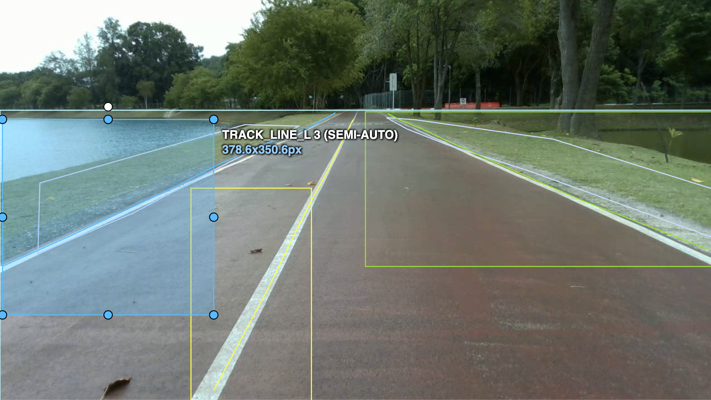

# Dataset Card Reservoir Lane Detection & Segmentation Dataset

## 1. Dataset Summary & Problem Statement
* **Objective:** ชุดข้อมูลภาพเส้นทางและสภาพแวดล้อมรอบอ่างเก็บน้ำ มหาวิทยาลัยสงขลานครินทร์เพื่อนำไปฝึกสอนโมเดลกลุ่ม Ultralytics เช่น YOLOv8-seg หรือ YOLOv11-seg
* **Source** ไฟล์วิดีโอบันทึกมุมมองหุ่นยนต์เคลื่อนที่รอบอ่างเก็บน้ำ (`psu-reservoir-2026Aug06_121427.mp4`)
* **Sampling Method** สุ่มเฟรมกระจายอย่างสม่ำเสมอตลอดไฟล์วิดีโอจำนวน 1,001 เฟรม และตัดเฟรมแรกที่มี Noise แสงจ้าออก คงเหลือ 1,000 เฟรม
* **Annotation Platform** CVAT (Collaborative Workspace) ร่วมกับ Segment Anything Model (SAM2)

---

## 2. Classes & Annotation Specifications
ชุดข้อมูลกำหนดป้ายกำกับทั้งหมด 5 คลาสตามโครงสร้างทางกายภาพของเส้นทางวิ่งรอบอ่างเก็บน้ำ:

| Class ID | Class Name | Annotation Type | Description |
| :---: | :--- | :--- | :--- |
| `0` | `lane` | Polygon / BBox | พื้นผิวถนน/ทางวิ่งหลักที่ใช้สัญจร |
| `1` | `track_line_l` | BBox / Polygon | เส้นแบ่งขอบทางฝั่งซ้าย (ขอบทางติดริมน้ำ) |
| `2` | `track_line_c` | BBox / Polygon | เส้นแบ่งเลนสีขาวกึ่งกลางถนน |
| `3` | `track_line_r` | BBox / Polygon | เส้นแบ่งขอบทางฝั่งขวา (ขอบทางติดเนินหญ้า/ทางเท้า) |
| `4` | `sideway` | Polygon / Mask | พื้นที่นอกทางวิ่ง (Non-track area) เช่น สนามหญ้า เนินดิน และน้ำ |

---
## 3. Sample Data Capture

*รูปที่ 1: ตัวอย่างการทำ Annotation เส้นแบ่งเลนและพื้นที่ข้างทางริมอ่างเก็บน้ำ*

*รูปที่ 2: ตัวอย่างการทำ Annotation เส้นขอบทางและพื้นผิวเลนบริเวณแนวร่มไม้*
